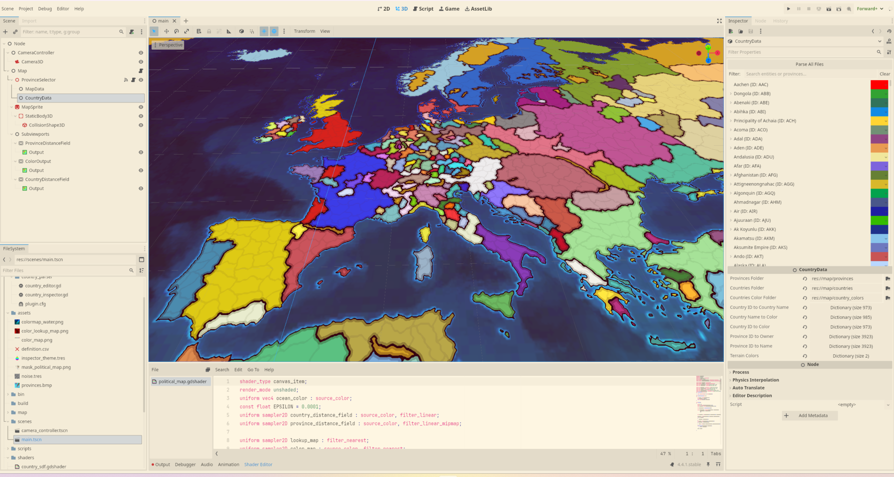

# Grand Strategy Map GDextension

GS Map is a Godot 4.4 GDExtension that provides editor tools for interacting with Europa Universalis provinces and country data as well as a shader pipeline that renders a map with smooth borders.

## Features

- Smooth borders using HQX shader
- Compute abstraction for generating `color_map`, `lookup_color` and `political_mask`
- Export/import functionality based on Europa Universalis 4 format
- Custom Inspector window for editing country data

## Minimal Demo Example using Gdscript

In the `main.tscn` scene you can understand how to use the custom nodes:

## Controls

Arrow keys to move the camera
Middle mouse to zoom in or out
Ctrl + Click will select a country
Click will change ownership between the province clicked and the selected country if there is one

## References

The intel [paper](https://www.intel.com/content/dam/develop/external/us/en/documents/optimized-gradient-border-rendering-in-imperator-rome.pdf) describing the shader techniques.
I found the HQX shader to godot in this [repo](https://github.com/Thomas-Holtvedt/opengs/blob/8a86111d108fe3bcaef8c827529978e84ff8131c/map/shaders/map3d.gdshader).
